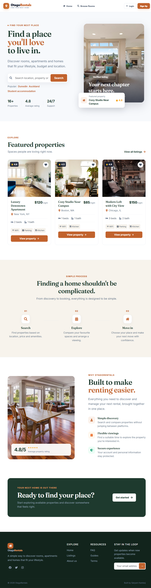
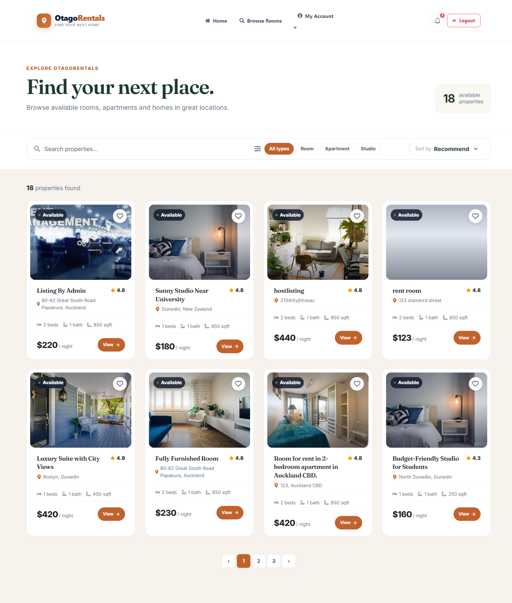
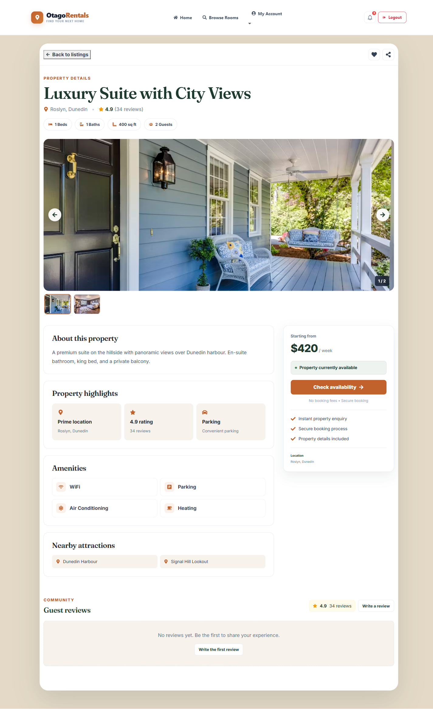
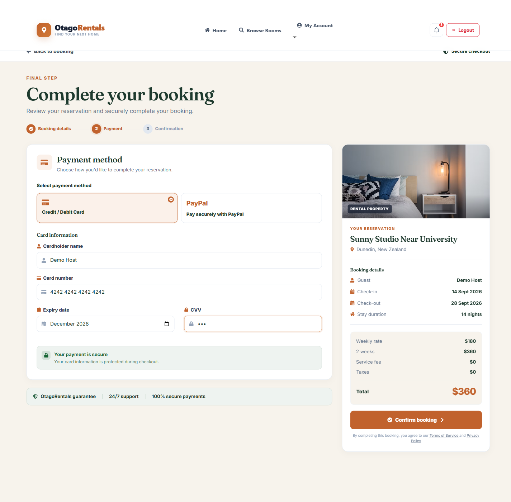
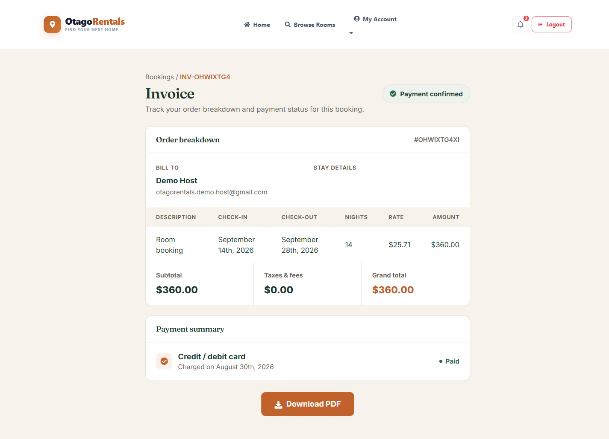
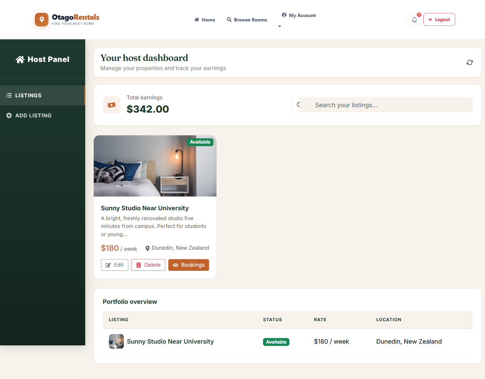
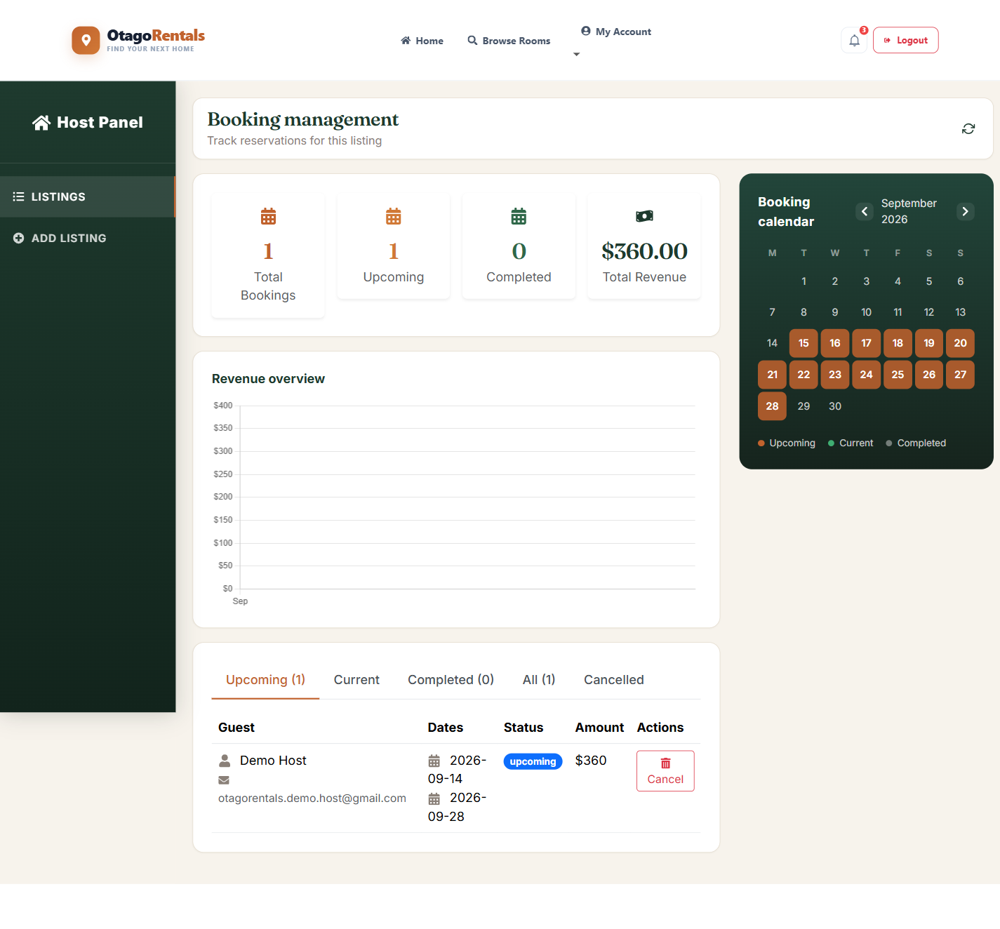
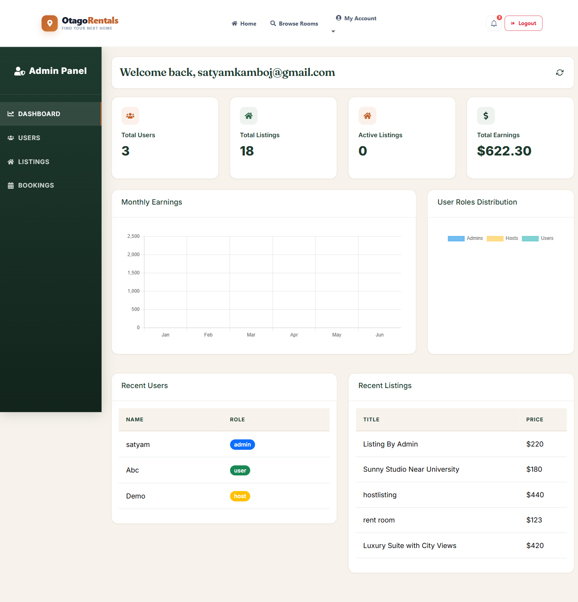
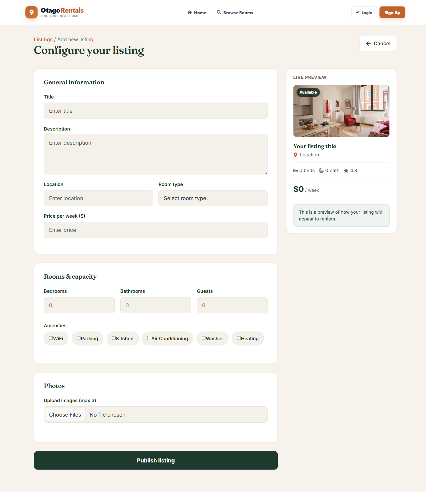

# OtagoRentals

A full-stack room rental marketplace built with React and Firebase. Guests can search, book and pay for properties; hosts can list properties and manage bookings and earnings; admins get a full back-office panel for users, listings and platform-wide bookings.



## Features

### For guests
- Browse and filter listings by type, price and location
- Rich property detail pages with photo gallery, amenities and guest reviews
- Multi-step booking flow: dates & guest details → secure checkout → invoice
- Downloadable PDF invoices
- Personal dashboard with booking history

### For hosts
- Publish, edit and delete listings with photos, amenities and pricing
- Dashboard with total earnings and a portfolio overview of all listings
- Per-listing booking management: stats, revenue chart and a booking calendar that highlights upcoming/current/completed reservations

### For admins
- Platform-wide dashboard: users, listings, active listings and total earnings, with monthly earnings and user-role charts
- User management with role changes (user / host / admin)
- Listing moderation (hide/unhide, delete)
- Booking oversight across all listings

### Platform
- Email/password and Google authentication (Firebase Auth)
- Role-based route protection (guest, user, host, admin)
- Firestore as the backing data store

## Screenshots

| | |
|---|---|
|  Browse listings |  Property detail |
|  Checkout |  Invoice |
|  Host dashboard |  Host booking calendar |
|  Admin dashboard |  Add a listing |

## Tech stack

- **Frontend:** React 18, React Router, React-Bootstrap, Tailwind CSS
- **Backend/Data:** Firebase Authentication, Firestore, Firebase Storage
- **Charts & PDFs:** Chart.js, jsPDF
- **Tooling:** Create React App via CRACO

## Getting started

### Prerequisites
- Node.js 18+ and npm
- A Firebase project with Authentication (Email/Password + Google) and Firestore enabled

### Setup

1. Clone the repo and install dependencies:
   ```bash
   git clone <repo-url>
   cd Room_Rental_Website
   npm install
   ```

2. Copy `.env.example` to `.env` and fill in your Firebase project's web app config (Firebase Console → Project settings → General → Your apps):
   ```bash
   cp .env.example .env
   ```

3. Start the dev server:
   ```bash
   npm start
   ```
   The app runs at [http://localhost:3000](http://localhost:3000).

### Available scripts

| Command | Description |
|---|---|
| `npm start` | Run the app in development mode |
| `npm run build` | Build a production bundle to `build/` |
| `npm test` | Run the test suite |

### Deploying

The repo includes a `firebase.json` configured for Firebase Hosting:

```bash
npm run build
firebase deploy --only hosting
```

## Project structure

```
src/
  components/       # Pages and feature components (listings, checkout, dashboards, etc.)
  components/dashboard/  # Shared sidebar/topbar layout + booking calendar used by host/admin panels
  context/          # Auth context (UserAuthContext)
  services/         # Firebase/Firestore data access (listings, bookings, users)
  utils/            # Shared helpers (e.g. fallback images)
```

## Roles

| Role | Access |
|---|---|
| Guest | Public pages only (home, about, listing browsing preview) |
| User | Book properties, manage own bookings, personal dashboard |
| Host | Everything a user can do, plus publish/manage listings and view booking activity |
| Admin | Full platform access: user role management, listing moderation, all bookings |

## License

This project is for personal/portfolio use.
